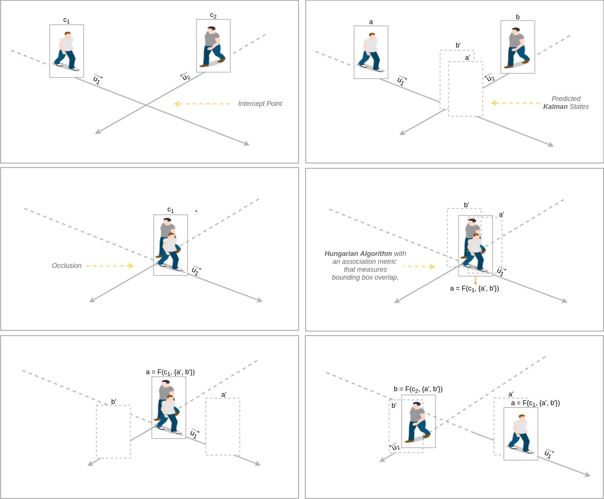
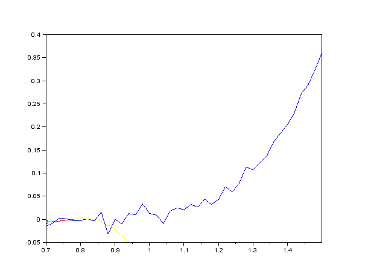
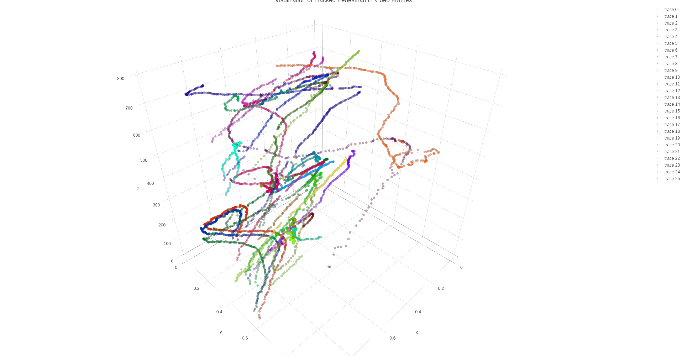
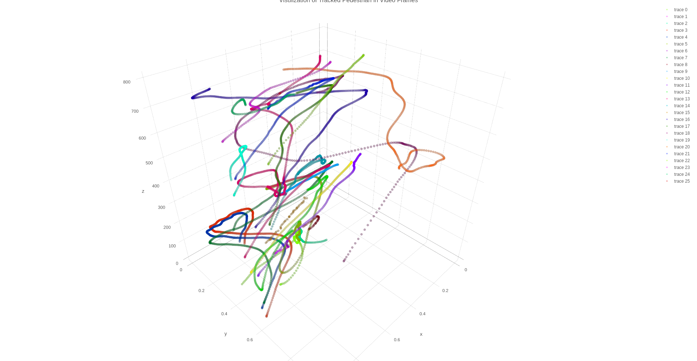

# HumaNet
[](https://opensource.org/licenses/Apache-2.0)

 Pedestrian Detection and Tracking: BEST 2018, NSC

## Poster Presentation


## How it works
### 1 .Object Detection

[Faster R-CNN](https://github.com/tensorflow/models/tree/master/research/object_detection): Faster Region-based Convolutional Nueral Networks

Please download the object detection model file [here](https://drive.google.com/open?id=1SG_iiRqOOm5RlltH0pzGT3FXXkF7Bdh_), and place it to ```./object_detection/faster_rcnn_resnet101_coco_11_06_2017/```

### 2. Object Tracking

[Deep SORT](https://github.com/nwojke/deep_sort): Simple Online and Realtime Tracking with a Deep Association Metric

Kalman Filter & Hungarian Algorithm



### 3. Tracking Optimization

Linear Interpolation and Savitzky-Golay Filter




### 4. Visualization of Human Trajectory





## Directory Structure
```
+HumaNet
	+object_detection
		+faster_rcnn_resnet101_coco_11_06_2017
		-realtime_detection.py
		-Object_Detection_Demo.ipynb
	+object_tracking
	+deep_sort
		-1_detection.py
		-2_generate_features.py
		-3_deep_sort.py
		-4_concatenate.py
		-5_show_results.py
		-pipeline.sh
		-scatter_plot.ipynb
	+dataset
		+captures
			+BEST_1
		+detections
		+features
		+outputs
			-BEST_1_opt.mp4
			-BEST_1_reg.mp4
		+tracks
		+videos
			-BEST_1.mp4
		-20p32w0047.txt
```
## Code Description
* ```Realtime_detection.py``` - Detection demo from video file
* ```Object_Detection_Demo.ipynb``` - Detection demo from image file (Running on Jupyter notebook)
* ```Pipeline.sh``` - Pipeline shell script that creates a set of python scripts to run the demo from beginning to end.
* ```Scatter_plot.ipynb``` - 3D Trajectory visualization (Running on Jupyter notebook)

## Prerequisites
* Python 3.5
* pip3 - tool for installing Python packages.
* GPU card with CUDA Compute Capability 3.0 or higher [NVIDIA's documentation](https://developer.nvidia.com/cuda-gpus)

## Installation
* [Install CUDA Toolkit 8.0](https://developer.nvidia.com/cuda-downloads)
* [Download cuDNN v5.1](https://developer.nvidia.com/cudnn)
* [Install TensorFlow with GPU](https://www.tensorflow.org/install/) (Note: Our current detection model is compatible for TensorFlow version 1.1)
* [How to use CUDA and the GPU Version of Tensorflow](https://pythonprogramming.net/how-to-cuda-gpu-tensorflow-deep-learning-tutorial/)
* Install OpenCV from Source
	- Ubuntu 16.04: How to install OpenCV
	- Install OpenCV3 on Ubuntu
* Install Python Packages
	- ```$ cd HumaNet/```
	- ```$ for req in $(cat requirements.txt); do sudo pip3 install $req; done```
* [Plotly](https://plot.ly/python/getting-started/) - Registration and Initialization for Online Plotting 
 

## How to run
* Detection Demo from video
	- $ ```cd object_detection```
	- $ ```python3 realtime_detection.py```
* Detection Demo from image - running on Jupyter notebook
	- $ ```cd object_detection```
	- $ ```jupyter notebook```
	- Click Object_Detection_Demo.ipynb file from jupyter’s interface
* Running Whole System via Shell Script
	- $ ```cd object_tracking```
	- $ ```./pipeline.sh```
NOTE: After running pipeline.sh output files will be stored at dataset/outputs (Video file) and dataset/captures (Image file)


# References:
1. Ross Girshick, Jeff Donahue, Trevor Darrell, and Jitendra Malik. 2014. Rich Feature Hierarchies for Accurate Object Detection and Semantic Segmentation. In Proceedings of the 2014 IEEE Conference on Computer Vision and Pattern Recognition (CVPR ’14). IEEE Computer Society, Washington, DC: 580-587. DOI:http://dx.doi.org/10.1109/CVPR.2014.81

2. Ross Girshick. 2015. Fast R-CNN. In Proceedings of the 2015 IEEE International Conference on Computer Vision (ICCV '15). IEEE Computer Society, Washington, DC: 1440-1448. DOI:http://dx.doi.org/10.1109/ICCV.2015.169

3. Shaoqing Ren, Kaiming He, Ross Girshick, and Jian Sun. 2015. Faster R-CNN: Towards Real-Time Object Detection with Region Proposal Networks. In Corinna Cortes, Neil D. Lawrence, Daniel D. Lee, Masashi Sugiyama, and Roman Garnett (Eds.), Advances in Neural Information Processing Systems 28-Proceedings of the Neural Information Processing Systems Conference (NIPS 2015). Neural Information Processing Systems Foundation, Inc. http://papers.nips.cc/paper/5638-faster-r-cnn-towards-real-time-object-detection-with-region-proposal-networks

4. Jonathan Huang, Vivek Rathod, Chen Sun, Menglong Zhu, Anoop Korattikara, Alireza Fathi, Ian Fischer, Zbigniew Wojna, Yang Song, Sergio Guadarrama, and Kevin Murphy. 2017. Speed/accuracy trade-offs for modern convolutional object detectors. In Proceedings of the Conference on Computer Vision and Pattern Recognition (CVPR 2017). The Computer Vision Foundation: 7310-7319. http://openaccess.thecvf.com/CVPR2017.py

5. J. R. R. Uijlings, K. E. A. van de Sande, T. Gevers, and A. W. M. Smeulders. 2013. Selective Search for Object Recognition. International Journal of Computer Vision 104, 2: 154-171. DOI:http://dx.doi.org/10.1007/s11263-013-0620-5

6. A. Bewley, G. Zongyuan, F. Ramos, and B. Upcroft. “Simple Online and Realtime Tracking,” in ICIP, 2016, pp. 3464–3468.

7. L. Leal-Taixé, A. Milan, I. Reid, S. Roth, and K. Schindler, “MOTChallenge 2015: Towards a Benchmark for Multi-target Tracking,” arXiv:1504.01942 [cs], 2015.

8. A. Milan, L. Leal-Taixé, I. Reid, S. Roth, and K. Schindler, “Mot16: A Benchmark for Multi-object Tracking,” arXiv preprint arXiv:1603.00831, 2016.

9. F. Yu, W. Li, Q. Li, Y. Liu, X. Shi, J. Yan. POI: Multiple Object Tracking with High Performance Detection and Appearance Feature. In BMTT, SenseTime Group Limited, 2016.

10. N. Wojke, A. Bewley, and D. Paulus. “Simple Online and Realtime Tracking with a Deep Association Metric,” IEEE International Conference on Image Processing (ICIP), 2017, pp. 3645–3659.

11. Aniket Bera, Sujeong Kim, Tanmay Randhavane, Srihari Pratapa, and Dinesh Manocha. “GLMP- realtime pedestrian path prediction using global and local movement patterns,” ICRA, 2016.
